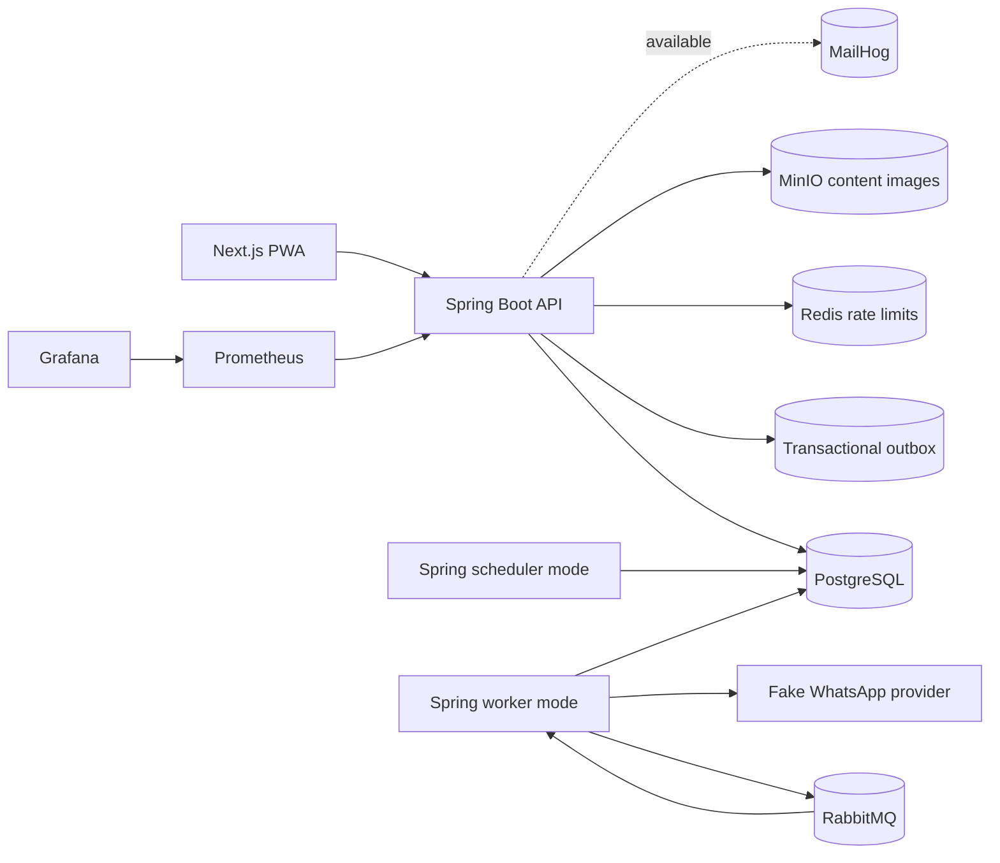

# Architecture

The three Java containers share one codebase. `APP_MODE` activates scheduled tasks; the worker profile activates the RabbitMQ consumer. Business state lives in PostgreSQL. A qualified attendance transaction updates the summary and inserts an outbox event. The worker publishes through `EventQueue`, currently backed by RabbitMQ. The consumer records the event ID and qualified user day before updating streaks, challenges, achievements, and the notification queue. Unique constraints protect replays.

Backend packages separate identity, users, programs, scheduling, attendance, progress, challenges, notifications, events, admin, content, and instructor concerns. Flyway owns schema changes. Transaction-sensitive flows use parameterized JDBC, while content uses Spring Data JPA with optimistic versioning. Redis backs rate limits. The content module stores optional article images through an object-storage interface backed by MinIO. MailHog is provisioned for a future email adapter.

Failure semantics: publishing after database commit can repeat an event; `processed_event` makes consumption idempotent. RabbitMQ retries a failed message three times and routes it to a dead letter queue. The notification worker claims deliveries, retries simulated failures three times, and writes fake WhatsApp messages with a unique notification ID. A database outage stops processing until services reconnect.
