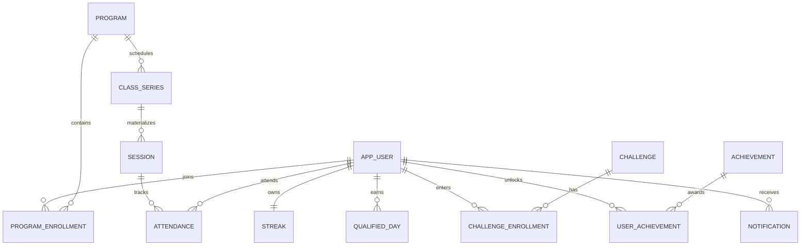

# Domain model

Flyway migrations under `backend/src/main/resources/db/migration` define the source of truth. UUIDs identify users, programs, series, sessions, attendance, challenges, achievements, notifications, referrals, and events. Foreign keys, unique constraints, and version columns protect key invariants.

An attendance row is unique per user and session. A heartbeat request ID is globally unique. A qualified day is unique per user and local date, so two classes on one day count once toward a streak. Achievements and enrollments also have unique user pairs. Event IDs are unique per consumer.
